# Game Mechanics Graph: Economic Power Dynamics
A comprehensive design document mapping the systems and interactions in a strategy game centered on economic power dynamics between the **State**, **Market**, and **Banks**.
---
## Executive Summary
```mermaid
graph TB
    subgraph "THE THREE PILLARS"
        STATE["🏛️ STATE<br/>Regulation & Policy"]
        MARKET["📈 MARKET<br/>Assets & Commerce"]
        BANKS["🏦 BANKS<br/>Capital & Influence"]
    end
    
    subgraph "PLAYER"
        PLAYER["👤 PLAYER<br/>Part of Market"]
    end
    
    STATE -->|"Taxes, Regulation,<br/>Subsidies"| MARKET
    STATE -->|"Interest Rate Targets,<br/>Banking Laws"| BANKS
    MARKET -->|"Lobbying,<br/>Campaign Finance"| STATE
    MARKET -->|"Collateral,<br/>Investment Vehicles"| BANKS
    BANKS -->|"Loans,<br/>Investment"| MARKET
    BANKS -->|"Financial Crisis,<br/>Bailout Pressure"| STATE
    
    PLAYER -.->|"Participates In"| MARKET
    BANKS -->|"Loans, Investment"| PLAYER
    STATE -->|"Taxes, Grants"| PLAYER
```
---
## 1. THE STATE
The State acts as the regulatory framework that shapes the playing field. It doesn't directly compete with the player but creates the environment in which they must operate.
### 1.1 Core Systems
| System | Description | Player Interaction |
|--------|-------------|-------------------|
| **Tax Collection** | Enforces taxes on income, profits, portfolios | Reduces player gains; avoidance strategies available |
| **Subsidies & Grants** | Provides financial incentives for targeted sectors | Unlocks opportunities in specific industries |
| **Government Contracts** | Releases bidding wars for lucrative contracts | Requires qualifying assets (contracting firms, manufacturing) |
| **Legislation** | Passes laws affecting what's legal/profitable | Can open or close entire market sectors |
| **Interest Rate Targets** | Sets benchmark rates affecting all loans | Influences bank loan terms, investment returns |
| **Tariffs & Trade Policy** | Controls import/export economics | Affects domestic vs. international asset value |
| **Zoning Laws** | Restricts land use and development | Gates real estate opportunities |
| **Monopoly Breaking** | Triggers antitrust actions | Risk for players with high market share |
| **Regulatory Agencies** | Industry-specific oversight bodies | Compliance costs, investigation risk |
*(Additional state systems may be added as needed during development)*
### 1.3 State Mechanics

**Policy Types:**
- **Progressive**: Gradual implementation (player can adapt)
- **Shock**: Immediate effect (catches unprepared players)
- **Sunset**: Temporary with expiration (time-limited opportunities)
---
## 2. THE BANKS
Banks are the engines of capital. They provide the funding that makes rapid expansion possible but come with strings attached—invisible strings.
### 2.1 Core Systems
| System | Description | Player Interaction |
|--------|-------------|-------------------|
| **Loans** | Provide capital with interest | Primary funding mechanism |
| **Investment** | Take equity stakes in businesses | Alternative to loans, dilutes ownership |
| **Credit Lines** | Revolving credit facilities | Flexible funding for operations |
| **Asset Management** | Manage player's investment portfolio | Hands-off growth option |
| **Insurance Products** | Risk mitigation services | Protects against catastrophic losses |
| **M&A Advisory** | Facilitate mergers and acquisitions | Enables complex corporate maneuvers |
### 2.2 Bank Reputation System
Banks maintain a **hidden reputation score** for the player. This affects:
- Loan interest rates offered
- Credit limits extended  
- Investment willingness
- Advisory quality
- Crisis behavior (bailout vs. calling loans)

```mermaid
graph LR
    subgraph "REPUTATION INDICATORS (Visible to Player)"
        TONE["Relationship<br/>Tone"]
        ACCESS["Access<br/>Level"]
        TERMS["Offered<br/>Terms"]
        RESPONSE["Response<br/>Time"]
    end
    
    subgraph "HIDDEN SCORE"
        REP["🔒 Reputation<br/>-100 to +100"]
    end
    
    REP --> TONE
    REP --> ACCESS
    REP --> TERMS
    REP --> RESPONSE
```

**Reputation Indicators (Hints to Player):**
| Indicator | Low Rep | Medium Rep | High Rep |
|-----------|---------|------------|----------|
| **Greeting Tone** | "Mr. [Name]" (cold) | "Good to see you" | "Our valued partner" |
| **Meeting Location** | Branch office | Regional HQ | Private dining |
| **Response Time** | 2-3 days | Same day | Immediate |
| **Loan Terms** | Market + 3% | Market rate | Market - 1% |
| **Credit Limit** | 50% of collateral | 100% of collateral | 200% of collateral |
| **Advisory Quality** | Generic advice | Sector insights | Insider information |
**Reputation Factors:**
| Factor | Impact | Description |
|--------|--------|-------------|
| **Payment History** | +++ | On-time payments boost rep significantly |
| **Default History** | --- | Any default severely damages reputation |
| **Business Alignment** | ++ | Investments in bank-preferred sectors |
| **Information Sharing** | + | Transparency about business plans |
| **Competing Actions** | -- | Taking deals to competitor banks |
| **Market Perception** | +/- | Public reputation affects bank willingness |
| **Crossing Interests** | --- | Acting against bank's holdings/investments |
### 2.3 Individual Bank Profiles
Each bank has distinct personality, interests, and **market dominance goals**. Banks will favor players who align with their territorial interests and penalize those who challenge their dominance without cooperation.
| Bank Type | Risk Tolerance | Specialty | Market Dominance Goal | Reaction to Challengers |
|-----------|---------------|-----------|----------------------|------------------------|
| **Investment Bank** | High | M&A, complex deals | Large cap equity markets | Hostile if cut out of deals |
| **Commercial Bank** | Medium | Business loans | SME lending sector | Competitive but negotiable |
| **Private Bank** | Low | Wealth management | UHNW client base | Protective of existing clients |
| **Venture Fund** | Very High | Startups, tech | Emerging tech sectors | Aggressive acquisition stance |
| **Shadow Bank** | Extreme | Distressed assets | Underwater asset market | Predatory toward defaulters |
### 2.4 Bank Dynamics

---
## 3. THE MARKET
The Market is the arena where the player operates. It contains all tradeable assets and represents the aggregate of economic activity.
### 3.1 Asset Types & Interactions

### 3.2 Asset Interaction Matrix
Each asset type provides different capabilities and synergizes with others:
| Asset Type | Primary Function | Synergies | State Interaction | Bank Interaction |
|------------|------------------|-----------|-------------------|------------------|
| **Stocks** | Passive income, voting rights | Enables hostile takeovers | Dividend taxes, SEC oversight | Portfolio as collateral |
| **Bonds** | Stable returns, lower risk | Hedge against volatility | Interest income taxes | Lower collateral value |
| **Real Estate** | Rental income, appreciation | Zoning opportunities | Property taxes, depreciation | Primary loan collateral |
| **Crypto** | High volatility speculation | DeFi opportunities | Regulatory uncertainty | Emerging collateral |
| **Land** | Development potential | Real estate synergy | Zoning laws, eminent domain | Development loans |
| **Art** | Store of value, prestige | Tax advantages | Donation write-offs | Specialty lending |
| **Operating Company** | Active income, actions | Government contracts | Corporate taxes | Business loans |
| **Manufacturing** | Production capability | Supply chain control | Tariff benefits | Equipment financing |
| **Contracting Firm** | Service capability | Government contracts | Procurement access | Project financing |
| **IP/Patents** | Licensing revenue | Defensive/offensive | R&D credits | IP-backed loans |
### 3.3 Strategic Asset Combinations

### 3.4 Market Events System
Events can be triggered by:
- **Random occurrence** (daily roll)
- **State actions** (policy changes)
- **Economic cycles** (boom/bust)
- **Player actions** (consequences)
- **Other players/NPCs** (competition)
| Event Category | Examples | Frequency |
|----------------|----------|-----------|
| **Policy Shift** | Industry legalization, new regulations | Rare |
| **Market Shock** | Crash, bubble, sector rotation | Uncommon |
| **Opportunity** | Contract bidding, distressed sale | Regular |
| **Crisis** | Supply chain breakdown, bank failures | Rare |
| **Personal** | Buyout offer, talent opportunity | Regular |
| **Discovery** | Blackmail, insider info, scandal | Uncommon |
---
## 4. THE PLAYER
The player is an actor within the Market, subject to State oversight, and dependent on Bank financing.
### 4.1 Player Domains

```mermaid
graph TB
    subgraph "PLAYER ENTITY STRUCTURE"
        PERSONAL["👤 Personal<br/>(Private Individual)"]
        PORTFOLIO["💼 Portfolio<br/>(Investment Holdings)"]
        BUSINESSES["🏢 Businesses<br/>(Owned Companies)"]
    end
    
    PERSONAL -->|"Salary/Dividends<br/>(Taxable Income)"| INCOME["💰 Personal Income"]
    PORTFOLIO -->|"Gains/Losses<br/>(Capital Gains Tax)"| GAINS["📊 Investment Returns"]
    BUSINESSES -->|"Distributions<br/>(Corporate Tax + Income Tax)"| PROFITS["💵 Business Profits"]
    
    LOANS["🏦 Loans"] -->|"Not Taxed"| PERSONAL
    LOANS -->|"Business Loans"| BUSINESSES
```

### 4.2 Two-Wallet System
| Wallet | Source | Uses | Tax Implications |
|--------|--------|------|------------------|
| **Personal** | Taxed income, loans | Living expenses, personal investments | Already taxed (income) |
| **Business** | Company revenue | Business expenses, reinvestment | Tax deductible |
**Key Mechanic**: Players can purchase **Lifestyle Upgrades** that provide AP bonuses and stat improvements at increasing costs. Some upgrades can be labeled as business expenses (legitimately or as grey-zone attempts).
### 4.3 Lifestyle Upgrades System
| Upgrade | Cost | Effect | AP Pool | Expense Type | Grey Zone? |
|---------|------|--------|---------|--------------|------------|
| **Personal Assistant** | $75,000/yr | +1 AP | ⚡ Instant | Personal | ❌ |
| **Executive Office** | $150,000/yr | +1 AP, +credibility | 📅 Quarterly | Business ✓ | ❌ |
| **Driver/Security** | $200,000/yr | +1 AP, +safety | ⚡ Instant | Either | ⚠️ |
| **Private Jet Access** | $500,000/yr | +1 AP, travel speed | ⚡ Instant | Business ✓ | ⚠️ |
| **Personal Chef/Wellness** | $120,000/yr | +lifespan bonus | — | Personal | ❌ |
| **Concierge Medicine** | $250,000/yr | +lifespan bonus | — | Either | ⚠️ |
| **Strategic Advisor** | $400,000/yr | +1 AP, planning | 🎯 Long-Term | Business ✓ | ❌ |
| **Political Connections** | $1,000,000/yr | +1 AP, lobby power | 📅 Quarterly | Business ✓ | ⚠️ |
| **Global Residence Network** | $2,000,000/yr | +1 each pool, tax | All | Either | ⚠️⚠️ |
> [!NOTE]
> Players may attempt to classify personal expenses as business expenses. This adds to audit risk and can backfire during audits.
---
## 5. ACTION POINT SYSTEM
### 5.1 Action Point Types

```mermaid
graph TB
    subgraph "ACTION POINT POOLS"
        subgraph "👤 PERSONAL AP"
            P_IAP["⚡ Instant AP"]
            P_QAP["📅 Quarterly AP"]
            P_LAP["🎯 Long-Term AP"]
        end
        subgraph "🏢 BUSINESS AP"
            B_IAP["⚡ Instant AP"]
            B_QAP["📅 Quarterly AP"]
            B_LAP["🎯 Long-Term AP"]
        end
    end
    
    subgraph "ACTION TYPES"
        INSTANT["⚡ Instant Actions<br/>(Immediate Effect)"]
        QUARTERLY["📅 Quarterly Actions<br/>(Next Quarter Resolution)"]
        LONGTERM["🎯 Long-Term Goals<br/>(Multi-Quarter Commitment)"]
    end
    
    P_IAP --> INSTANT
    P_QAP --> QUARTERLY
    P_LAP --> LONGTERM
    
    B_IAP --> INSTANT
    B_QAP --> QUARTERLY
    B_LAP --> LONGTERM
```

> [!IMPORTANT]
> Each AP type is a **separate pool** that upgrades independently. Having 5 Instant AP doesn't affect your Quarterly or Long-Term capacity.
### 5.2 Action Categories
#### Instant Actions (Same Day, Sequence Matters)
| Action | AP Cost | Description |
|--------|---------|-------------|
| Buy/Sell Securities | 1 | Trade stocks, bonds, crypto |
| Buy/Sell Property | 2 | Real estate transactions |
| Take Loan | 1 | Accept bank loan offer |
| Repay Loan | 1 | Pay off existing debt |
| Issue Press Release | 1 | Public communication |
| Emergency Meeting | 2 | Immediate crisis response |
#### Quarterly Actions (Resolve at Quarter Start)
| Action | AP Cost | Description |
|--------|---------|-------------|
| Hire Manager | 1 | Search for executive talent |
| Research Competitor | 2 | Gather intelligence |
| Launch Product | 2 | Business development |
| File Lawsuit | 2 | Legal action |
| Lobby Government | 3 | Influence policy |
| Apply for Grant | 1 | Request government funding |
#### Long-Term Goals (HOI4-Style National Focuses)
Goals create **personal player advantages** or **slight environmental shifts**, not market-dominating outcomes. **Switching goals resets all progress** unless the goal explicitly allows pausing.
| Goal Type | Duration | Effect | Scope |
|-----------|----------|--------|-------|
| **Policy Influence** | 4-8 quarters | +modifier when policy type is debated | Personal advantage |
| **Sector Expertise** | 6-12 quarters | +10% returns in sector, unlock expert actions | Personal advantage |
| **Political Network** | 2-4 quarters | Advance warning on policy shifts, lobby discount | Personal advantage |
| **R&D Initiative** | 4-10 quarters | Unlock new product/IP, +company valuation | Company advantage |
| **Infrastructure Project** | 8-16 quarters | Physical asset + regional influence modifier | Slight env. shift |
| **Reputation Campaign** | 3-6 quarters | +bank reputation, +public image | Personal advantage |
### 5.3 Action Point Pools & Scaling
**Base Personal AP (per quarter):**
| Pool | Base | Description |
|------|------|-------------|
| ⚡ **Instant AP** | 3 | Same-day actions with immediate effect |
| 📅 **Quarterly AP** | 2 | Actions that resolve next quarter |
| 🎯 **Long-Term AP** | 1 | Slots for ongoing multi-quarter goals |
**Pool-Specific Upgrades:**
| Upgrade | Pool Affected | AP Change | Source |
|---------|---------------|-----------|--------|
| Personal Assistant | ⚡ Instant | +1 | Personal hire |
| Executive Office | 📅 Quarterly | +1 | Lifestyle upgrade |
| Strategic Advisor | 🎯 Long-Term | +1 | Senior hire |
| C-Suite Manager | ⚡ Instant | +1 per role | Business investment |
| Board Analyst | 📅 Quarterly | +1 | Company hire |
| Partnership | All pools | +1 each (shared control) | Strategic alliance |
| Health/Age Decline | All pools | -1 each | Negative events |
| Active Crisis | ⚡ Instant | -1 | During crisis |
**Business AP Allocation (Tiered by Ownership):**
| Ownership % | ⚡ Instant | 📅 Quarterly | 🎯 Long-Term |
|-------------|-----------|--------------|---------------|
| < 5% | 0 | 0 | 0 (passive) |
| 5-15% | 2 | 0 | 0 |
| 15-25% | 2 | 1 | 0 |
| 25-50% | 3 | 2 | 1 |
| > 50% | 100% | 100% | 100% |
---
## 6. TAX MECHANICS
### 6.1 Tax Rates
| Tax Type | Rate | Application |
|----------|------|-------------|
| **Income Tax** | 50% | Salary income only |
| **Dividend Tax** | 30% | Dividend distributions |
| **Corporate Tax** | 10% | Company profits |
| **Capital Gains** | 30% | Portfolio profits (realized) |
| **VAT** | 25% | Consumption/purchases |
| **Property Tax** | 1-2% | Real estate (annual) |
| **Estate Tax** | 40% | On death |
### 6.2 Tax Avoidance Strategies (Grey Zone Mechanics)

```mermaid
graph LR
    subgraph "LEGAL GREY ZONE"
        S1["Asset Mortgaging<br/>(Borrow against holdings)"]
        S2["Depreciation Abuse<br/>(Paper losses)"]
        S3["Transfer Pricing<br/>(Cost shifting)"]
        S4["Trust Structures<br/>(Ownership obscuring)"]
        S5["Art Donations<br/>(Inflated valuations)"]
        S6["Offshore Entities<br/>(Tax jurisdiction shopping)"]
    end
    
    S1 --> RISK["❗ Audit Risk"]
    S2 --> RISK
    S3 --> RISK
    S4 --> RISK
    S5 --> RISK
    S6 --> RISK
    
    RISK --> PENALTY["💔 Penalties if Caught"]
```

**Strategy: Borrow-Buy-Die**
| Step | Action | Tax Impact |
|------|--------|------------|
| 1. Accumulate | Buy appreciating assets | No tax (unrealized gains) |
| 2. Borrow | Take loans against assets | No tax (loans aren't income) |
| 3. Spend | Use loan proceeds to live | No tax (it's debt) |
| 4. Repeat | Refinance as assets appreciate | Continuous tax-free liquidity |
### 6.3 Tax Event Triggers
| Event | Trigger | Tax Due |
|-------|---------|---------|
| Sell Asset | Player sells position | Capital gains on profit |
| Take Salary | Extract from business | Income tax (50%) |
| Dividend | Company distributes profits | Dividend tax (30%) |
| Year End | Annual accounting | Remaining corporate taxes |
| Audit | Random + risk factors | Penalties + back taxes |
### 6.4 Audit System
Audits are **chance-based** and triggered when grey-zone exposure exceeds thresholds. When an audit occurs, the player **chooses how to respond**—this allows other game assets (lawyers, political connections, evidence) to influence the outcome.

**Audit Response Assets:**
- Top-tier law firm → +30% contest success
- Political connections → +20% contest success
- Clean paper trail → +15% contest success
- Scapegoat/fall guy → Deflect to subsidiary
---
## 7. GAMEPLAY LOOP
### 7.1 Daily Cycle (= 1 Quarter)

```mermaid
graph TB
    subgraph "QUARTER START"
        Q1["📥 Quarterly Actions Resolve"]
        Q2["📊 Long-Term Goal Progress"]
        Q3["📰 News & Events Revealed"]
    end
    
    subgraph "PLAYER TURN"
        P1["⚡ Spend Action Points"]
        P2["📋 Queue Quarterly Actions"]
        P3["🎯 Adjust Long-Term Goals"]
        P4["💼 Manage Businesses"]
    end
    
    subgraph "QUARTER END"
        E1["💰 Income/Expenses Settle"]
        E2["📈 Market Updates"]
        E3["🏦 Loan Interest Due"]
    end
    
    Q1 --> Q2 --> Q3 --> P1 --> P2 --> P3 --> P4 --> E1 --> E2 --> E3
    E3 -->|"Next Day"| Q1
```

### 7.2 Annual Cycle
| Quarter | Special Events |
|---------|----------------|
| Q1 | Tax filing deadline, budget announcements |
| Q2 | Annual reports, shareholder meetings |
| Q3 | Summer doldrums, policy debates |
| Q4 | Holiday spending, year-end positioning |
### 7.3 Event Resolution

---
## 8. INTERACTION WEB
### 8.1 Primary Interaction Flows

### 8.2 Example Interaction Chains
**Chain 1: Interest Rate Cascade**
```
State raises rates → Banks increase loan costs → Player expansion slows → 
Market demand drops → Asset prices fall → Player net worth declines →
Player defaults on loans → Bank calls collateral → Player loses assets
```
**Chain 2: Policy Opportunity**
```
State debates environmental law → Player recognizes opportunity →
Player invests in green sector → Law passes → Sector value increases →
Player sells at profit → Bank reputation improves → Better loan terms
```
**Chain 3: Crisis Exploitation**
```
Market crash occurs → Banks tighten lending → Weak players fail →
Distressed assets available → Player with cash buys cheaply →
Recovery begins → Asset values rise → Player wealth grows
```
---
## 9. DATA STRUCTURES (for Nuxt+Vue+Supabase)
### 9.1 Core Tables
```sql
-- State Configuration
CREATE TABLE state_policies (
    id UUID PRIMARY KEY,
    name TEXT,
    category TEXT, -- 'tax', 'regulation', 'subsidy', etc.
    parameters JSONB, -- flexible policy parameters
    status TEXT, -- 'proposed', 'active', 'expired'
    effective_from TIMESTAMPTZ,
    expires_at TIMESTAMPTZ
);
-- Bank Entities
CREATE TABLE banks (
    id UUID PRIMARY KEY,
    name TEXT,
    type TEXT, -- 'investment', 'commercial', 'private', etc.
    risk_tolerance FLOAT,
    specialties JSONB,
    hidden_agenda TEXT,
    economic_health FLOAT -- affects behavior
);
-- Player-Bank Relationship (Hidden Reputation)
CREATE TABLE player_bank_reputation (
    player_id UUID REFERENCES players(id),
    bank_id UUID REFERENCES banks(id),
    reputation_score INTEGER, -- -100 to +100, hidden
    last_interaction TIMESTAMPTZ,
    PRIMARY KEY (player_id, bank_id)
);
-- Market Assets
CREATE TABLE assets (
    id UUID PRIMARY KEY,
    type TEXT, -- 'stock', 'bond', 'real_estate', 'crypto', etc.
    name TEXT,
    sector TEXT,
    current_value DECIMAL,
    metadata JSONB, -- type-specific properties
    state_restrictions JSONB, -- what policies affect it
    synergies JSONB -- related asset types
);
-- Player Actions Queue
CREATE TABLE action_queue (
    id UUID PRIMARY KEY,
    player_id UUID REFERENCES players(id),
    action_type TEXT, -- 'instant', 'quarterly', 'longterm'
    action_code TEXT,
    parameters JSONB,
    ap_cost INTEGER,
    queued_at TIMESTAMPTZ,
    resolves_at TIMESTAMPTZ,
    status TEXT -- 'pending', 'resolved', 'cancelled'
);
-- Long-Term Goals (National Focus style)
CREATE TABLE player_goals (
    id UUID PRIMARY KEY,
    player_id UUID REFERENCES players(id),
    goal_type TEXT,
    target JSONB,
    quarters_invested INTEGER,
    quarters_required_min INTEGER,
    quarters_required_max INTEGER,
    progress FLOAT,
    started_at TIMESTAMPTZ
);
-- Events
CREATE TABLE events (
    id UUID PRIMARY KEY,
    event_type TEXT,
    trigger_conditions JSONB,
    effects JSONB,
    player_choices JSONB,
    duration_quarters INTEGER,
    expires_at TIMESTAMPTZ
);
```
### 9.2 Core Type Definitions
```typescript
// State System Types
interface StatePolicy {
  id: string;
  name: string;
  category: 'tax' | 'regulation' | 'subsidy' | 'trade' | 'zoning' | 'monetary';
  parameters: Record<string, any>;
  status: 'proposed' | 'debating' | 'voting' | 'active' | 'expired';
  effectiveFrom: Date;
  expiresAt?: Date;
}
// Bank System Types
interface Bank {
  id: string;
  name: string;
  type: 'investment' | 'commercial' | 'private' | 'venture' | 'shadow';
  riskTolerance: number;
  specialties: string[];
  hiddenAgenda: string;
  economicHealth: number;
}
interface BankRelationship {
  bankId: string;
  reputationScore: number; // -100 to +100, hidden from player
  indicators: ReputationIndicators; // visible to player
}
interface ReputationIndicators {
  greetingTone: 'cold' | 'neutral' | 'warm' | 'enthusiastic';
  meetingLocation: 'branch' | 'regional' | 'hq' | 'private';
  responseTime: 'delayed' | 'normal' | 'quick' | 'immediate';
  termModifier: number; // -3% to +3%
  creditMultiplier: number; // 0.5x to 2x
}
// Market Asset Types
type AssetType = 
  | 'stock' | 'bond' | 'option' | 'etf'
  | 'commercial_property' | 'residential_property' | 'land' | 'reit'
  | 'operating_company' | 'franchise' | 'startup' | 'joint_venture'
  | 'crypto' | 'art' | 'commodity' | 'patent';
interface Asset {
  id: string;
  type: AssetType;
  name: string;
  sector: string;
  currentValue: number;
  stateRestrictions: string[];
  synergies: string[];
  capabilities: AssetCapability[];
}
type AssetCapability = 
  | 'government_contracts'
  | 'manufacturing'
  | 'lobbying'
  | 'construction'
  | 'financial_services'
  | 'tax_shelter';
// Action System Types
interface ActionDefinition {
  code: string;
  name: string;
  type: 'instant' | 'quarterly' | 'longterm';
  apCost: number;
  requirements: ActionRequirement[];
  effects: ActionEffect[];
}
interface ActionRequirement {
  type: 'asset' | 'cash' | 'ownership' | 'reputation';
  target: string;
  minimum: number;
}
interface ActionEffect {
  type: 'transaction' | 'modifier' | 'event_trigger' | 'goal_progress';
  target: string;
  value: any;
}
// Long-Term Goal (HOI4 Focus Style)
interface LongTermGoal {
  id: string;
  type: string;
  name: string;
  description: string;
  quartersInvested: number;
  quartersRequiredRange: [number, number]; // min, max
  progressPercentage: number;
  canSwitch: boolean;
  opportunityCost: string[];
}
// Event Types
interface GameEvent {
  id: string;
  type: 'random' | 'triggered' | 'scheduled';
  category: 'opportunity' | 'crisis' | 'personal' | 'policy' | 'market';
  title: string;
  description: string;
  choices?: EventChoice[];
  modifiers?: EventModifier[];
  duration?: number;
  expiresAt?: Date;
}
interface EventChoice {
  label: string;
  requirements?: ActionRequirement[];
  effects: ActionEffect[];
}
interface EventModifier {
  target: 'player' | 'bank' | 'market' | 'state';
  attribute: string;
  value: number;
  operation: 'add' | 'multiply' | 'set';
  duration: number;
}
```
---
## 10. LIFETIME & WIN CONDITION
### 10.1 Player Lifetime System
The player starts as an **18-year-old** and has a natural lifespan. Death is the end condition for the standard game mode.

| Lifespan Modifier | Effect |
|-------------------|--------|
| **Concierge Medicine** | +3 years |
| **Personal Chef/Wellness** | +2 years |
| **Low Stress Lifestyle** | +2 years |
| **Chronic Overwork** | -2 years |
| **Major Crisis (each)** | -1 year |
| **Health Event (random)** | -1 to -5 years |
### 10.2 Game Modes
| Mode | Time Control | Stakes | Purpose |
|------|--------------|--------|----------|
| **Standard** | Real-time (1 day = 1 quarter) | High (permadeath) | Main game experience |
| **Sandbox** | Player-controlled time advance | None | Strategy testing, experimentation |
### 10.3 Endgame Scoring
At death (or chosen retirement in Sandbox), the player's legacy is scored:
| Category | Weight | Measurement |
|----------|--------|-------------|
| **Net Worth** | 40% | Total assets - liabilities |
| **Empire Scale** | 25% | Companies owned, market share |
| **Influence** | 20% | Political connections, bank standings |
| **Legacy** | 15% | Achievements, milestones reached |
---
## 11. RESOLVED DESIGN DECISIONS
| Decision | Resolution |
|----------|------------|
| Bank Personality | Banks have market dominance goals and penalize those who challenge without cooperation |
| Base AP | 3 per quarter (starting) |
| Tax Avoidance Risk | Chance-based audits with player response choices |
| Goal Switching | Resets progress unless goal specifies otherwise |
| Minority Shareholder AP | Tiered: 5%=2 instant, 15%=1 quarterly swap, 25%=3 flexible |
| Event Frequency | 1 random event/day + consequence events from actions |
| Additional State Systems | Tabled for now |
---
## Verification Plan
### Automated Testing
- Unit tests for tax calculations
- Integration tests for action resolution
- Lifetime/aging system validation
### Manual Verification  
- Playtest action point economy
- Validate tax avoidance risk/reward balance
- Test audit response system with different assets
- Verify lifetime incentives feel meaningful
---
*Design decisions have been resolved based on user feedback. Ready for implementation.*
